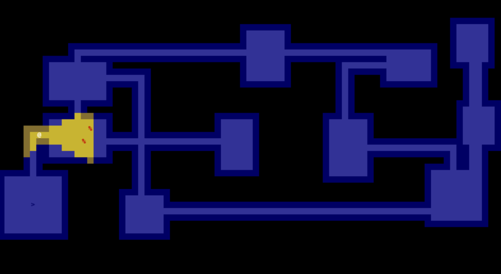

# Game name: Character Dungeon
- Inspired by: https://github.com/TStand90/tcod_tutorial_v2/tree/2020/part-13


## How to run:

- Install python 3.x and pip3 on your local machine
- use pip3 to install all the required packages
```bash
    pip3 install -r requirements.txt
```
- run main.py
```bash
    python3 main.py
```

Screenshot:


